# 2025-11-4

## 同步双频 RSDB

原文：<https://zhuanlan.zhihu.com/p/91495785>

文中对比了双频双发（Dual Band Dual Concurrent，DBDC），并发双频（Simultaneous Dual Band，SDB），同步双频（Real Simultaneous Dual Band，RSDB）

首先这里说明都是包含通路的情况，通路有两个部分：

- 基带处理模块（主要是 PHY+MAC 的处理部分）
- RF 前端（包含天线，PA，LNA 等等）
SDB：有两块 IC 和两个 RF 模块，可以同时发射不同的频段

应用就是多频分流，或者不同频段给不同权限用户使用，或者 5G 频段做组网中继，用户使用 2.4G 频段

RSDB：在单块 IC 上集成了两个 RF 模块，实现两个频段同时工作。

应用就是流量分流或者双频协同工作提升性能。

# 2025-11-7

## PCF 工作模式

原文：<https://zhuanlan.zhihu.com/p/20750579>

首先 PCF（Point Coordination Function）作为由 AP 来协调各个 STA 发送数据的方式，它可以和普通的 DCF（Distributed Coordination Function）兼容。

如何兼容，或者说两种模式是如何切换的呢：

在 CFP（Contention-Free Period）无竞争时间运行 PCF，在 CP 竞争时间运行 DCF。

CP -> CFP：通过发送了设置 CFPMaxDuration 的 beacon 帧，来让所有 STA 的 NAV 都被设为最大，并在 CFP 期间的所有帧都设置 CFPMaxDuration；

CFP -> CP：通过发送广播帧 CF-END（管理帧）来清空所有 STA 的 NAV；
PCF 工作模式包含两个要素：

- PC（point coordinator）：即点协调器，一般情况下，都是由 AP 做点控制器。
- CF-Pollable STA：支持 PCF 机制的节点。 

我们引入轮询表的概念，PC 按照轮询表的顺序，按照升序，依次对节点进行轮询。在免竞争期间，除非基站以轮询帧提出要求，否则工作站不得进行传输数据。轮询具体会采用 CF-POll 帧来执行，节点接收到 CF-POll 之后，向 PC 反馈数据。

然后这期间会有四种情况（下面的箭头会从 AP 开始，依次表明 AP 和 STA 发送的帧类型）：
- CF-Poll -> Data -> CF-ACK
  如果是 STA 反馈的 Data 帧被 AP 接收后没有通过 CRC 校验，则 AP 不会回 CF-ACK，AP 直接轮询下一个 STA
  如果是 CF-Poll STA 没接收到，那么 AP 会等待 SIFS+SLOT（PIFS）时间后，轮询下一个 STA
- DATA+CF-Poll -> Data+CF-ACK -> CF-ACK
- CF-Poll -> Data -> CF-Poll+CF-ACK -> Data
  这里第一个 CF-Poll 是给 STA1，第二个 CF-Poll+CF-ACK 是在确认收到 STA1 的同时，通知 STA2
- CF-END -> CF-END+CF-ACK

# 2025-11-10

## 隐藏终端/暴露终端问题

原文：<https://zhuanlan.zhihu.com/p/20780796>

- 隐藏终端问题就是两个 STA 彼此监测不到对方，但是都给同一个 AP 发包，就会导致其不能通过物理载波监听的方法检测信道是否空闲。

解决方案：RTS/CTS 模式，增加客户端功率，消除中间的障碍物，将造成隐藏终端问题的节点或者 AP 移动位置，控制原始 AP 的功率再添加入一个新的 AP

- 暴露终端的问题是节点间能互相监听对方，但是它们却是给不同的 AP 发包，导致它们误以为信道被占用，实则没有。

解决方案：BSS Coloring（802.11ax 正式加入）

## BSS Coloring

原文：<https://zhuanlan.zhihu.com/p/76362759>

大概就是在 AP 发的 Beacon 帧中 HE Element 里带一个 BSS Coloring 子字段。其中有 6 个 bit 用来表示颜色，可以标识 63 个 BSS。

选择颜色的方式就是 AP 先识别颜色冲突（一种是 AP 自己检测到其他 AP 发送的 BSS Coloring 字段，一种是 STA 向 AP 上报 BSS Coloring 冲突），然后 AP 会通过 Beacon 帧，探测响应和重新关联响应帧向所有与之相连的 STA 发送更改颜色的通知。

BSS Coloring 的信息是同时被添加在 PHY 层和 MAC 层中的。在 802.11ax PHY 头部的 Preamble 中，其 SIG-A 字段也包含 BSS Coloring 信息字段。

# 2025-11-12

## 802.11b 发送过程和接收过程

原文：<https://zhuanlan.zhihu.com/p/21483155>

### 802.11b 物理层的格式

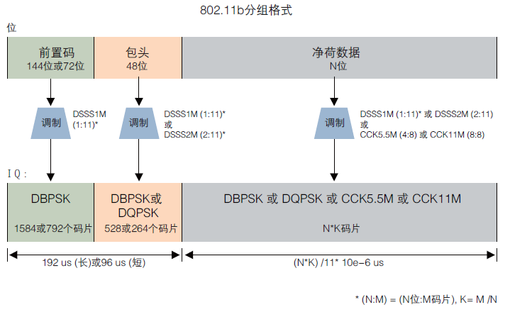
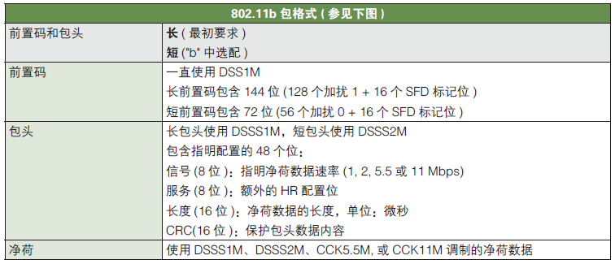

SFD 标记位是用于找数据帧起始位置的，对应 header 有如下的细节：
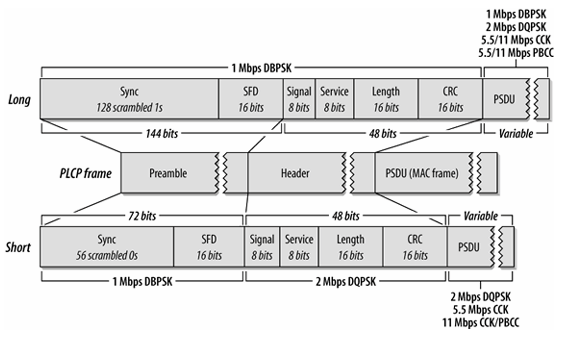

- Signal： 传输速率，在 802.11b 中有 4 个传输速率；
- Service：HR（High Rate）配置位，由于 802.11b 相较于一开始的 802.11 协议扩频码以及调制技术得到升级，为了与传统的 802.11 协议做区别，命名为 HR；
- Length：长度位，单位为 us，是 payload 的传输时间（16 位无符号整型）。

### 802.11b 发送过程

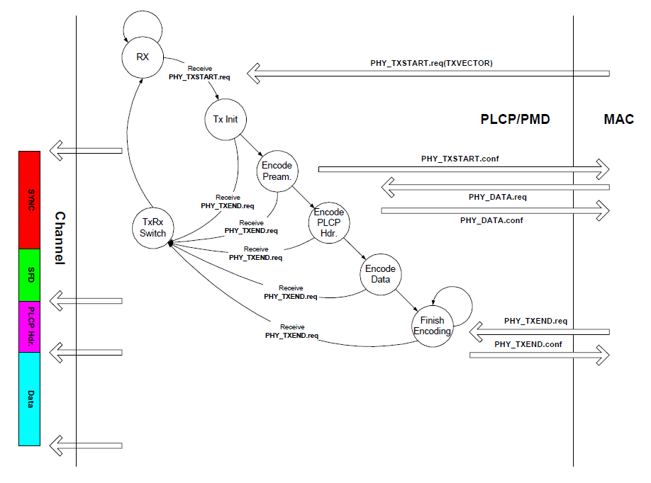
在发送过程中有一个机制，就是当 PHY 层收到 MAC 层的 `PHY_TXEND.req` 时候，无论此发送过程在哪个阶段，都会立即切换到 TxRx Switch 状态。

1. 初始状态是 Rx，通过 MAC 层的 `PHY_TXSTART.req` 进入 Tx Init 状态，不过如果此时信道并非空闲，则不会转移到 Tx Init 状态，而是转移回自己；
2. 当切换到了 Tx Init 状态，如果没有收到 `PHY_TXEND.req`，它会进入 Encode Pream. 和 Encode PLCP Hdr. 这两个状态，即封装 Preamable 和 PLCP header 这两个部分；
3. 当封装好前两个部分后，MAC 层会向 PHY 发送 `PHY_DATA.req`，并通过物理层进行发送。最后上层通过 `PHY_TXEND.req` 告知数据结束，经 TxRx Switch 切换至 Rx 状态。

### 802.11b 接收过程

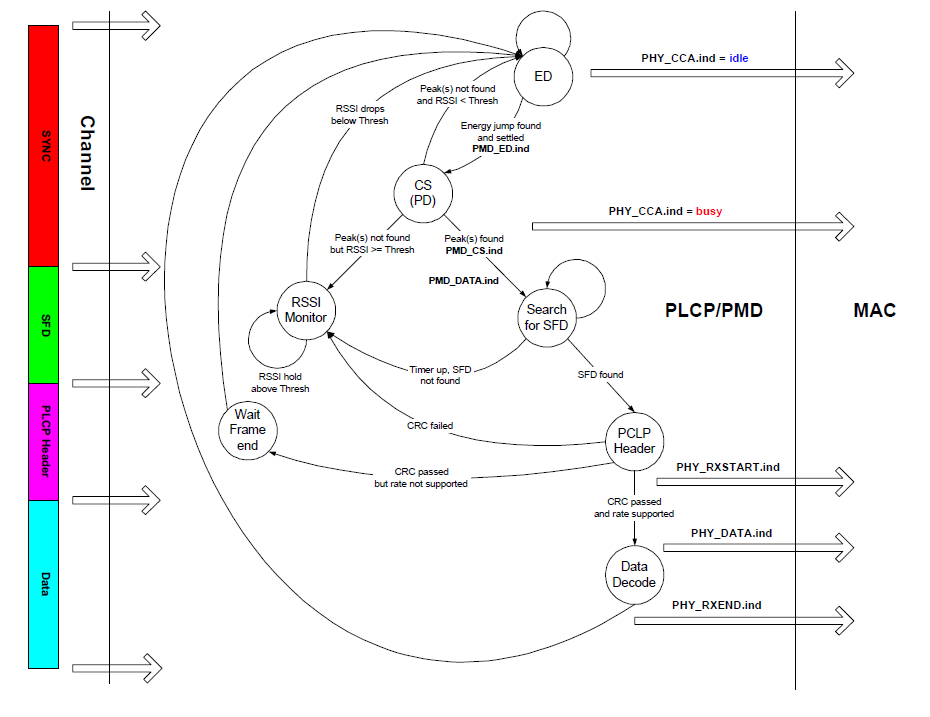

1. 初始状态是 Rx 接收状态，进行载波监听（CCA），判断信道中的能量是否超过了预设的 `PMD_ED.indicate`。同时在 ED 状态下 `PHY_CCA.ind` 为 idle，此时 STA 才可以发送数据。
2. 如果超过该阈值，状态就从 ED 变为 CS，通过载波侦听 CS 的方式，检测是否为一个 802.11 帧。这里主要是排除是干扰的原因使得能量过大。同时 `PHY_CCA.ind` 为 busy；
   1. 如果能找到一个 preamble 相关的峰值的话，那么就通过 `PMD_CS.ind` 触发寻找 SFD 的状态；
   2. 如果找不到相关峰值或者找不到 SFD，则进入 RSSI Monitor 状态，直到 RSSI 的值小于给定的阈值才会返回 ED 状态。
3. 找到 SFD 后就可以确认这个数据帧了，之后进行 CRC 校验，查看 STA 是否支持这个传输速率（如果过快可能导致无法解调），这里是通过带有后续接收数据信息（包长度以及传输速率等）的 PLCP Header 来进行校验的。成功则向发送 MAC 层发送 `PHY_RXSTART.ind`；
4. 最后读取完毕后会向 MAC 层反馈 `PHY_RXEND.ind`。
## 802.11 a/g 的发送过程和接收过程
### 802.11 a/g 物理层头部
前置码有三个部分：STF，LTF，SIGNAL
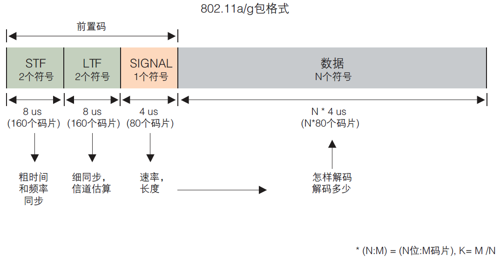
这里整个物理层的头部都叫做 preamble，这个 preamble 比 802.11b 的 PLCP preamble 概念不同，其对 PLCP 和 PMD 子层有着很明确的分界。
具体功能：
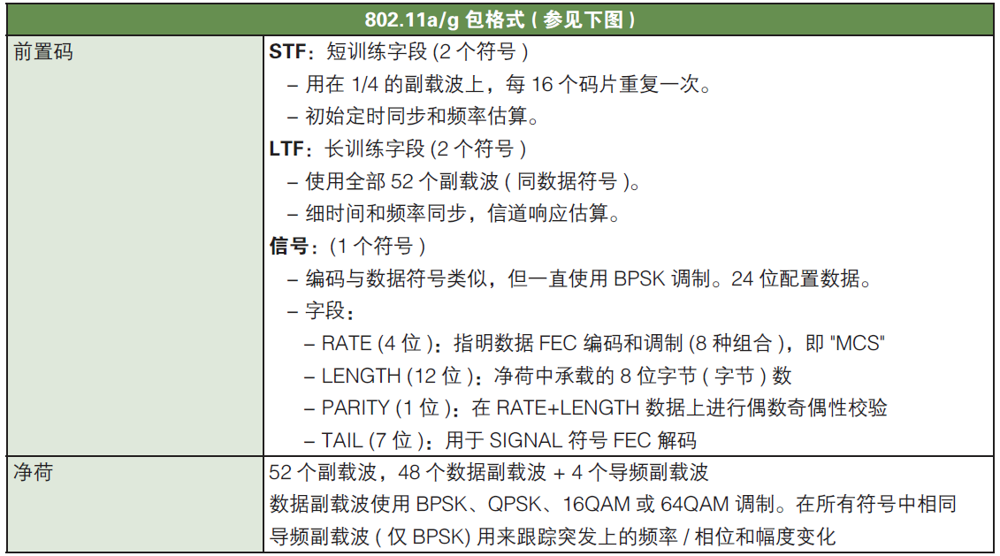
而在原版协议中，有更详细的描述：

802.11a/g 的物理层头部有：
* STF：主要是 10 个短 symbol 组成，其中每一个 symbol 是 0.8 μs，其中 $t_1$ 到 $t_7$ 包含信号探测，AGC，分集选择，而 $t_8$ 到 $t_{10}$ 则是 Coarse Freq，偏移估计，和事件同步。这里有三个功能：
	* 帧同步，即判断有没有一个数据帧到达，从而寻找 SFD（Start-of-Frame Delimiter）；
	- 粗频率同步，这里主要是针对频率偏移所做的一个同步的工作，同时也正好是对应后面的细频率同步的阶段（即 LTF 阶段）；
	- 通过 10 个短 symbol 自相关或互相关，可以产生出尖峰便于 STA 识别。
- LTF（Long Training Field），其主要功能是细频率同步和信道估计。LTF 分为是三个部分：
	- GI，即保护间隔，用来防止 ISI，即符号间干扰；
	- 两个独立的长训练 symbol，T1 以及 T2。
* SIGNAL
	* Rate 标识数据包的传输速率，即采用什么调制方式，编码速率，一般协议中直接所述标识了 MCS 值（MCS 对应不同的速率），长度为 4 bit，预留了两个；
	* Length 标识了数据包（具体 payload）的长度，不同于 802.11b 是传输时间；
	* Parity 是用来做偶数奇偶性校验；
	* Tail 位是有时候为了做 FEC 而存在的；
	* Reserved 位，既可能用来表示这个是一个 802.11n MF Frame（MF 即是mixed format）或者预留给奇偶校验。
	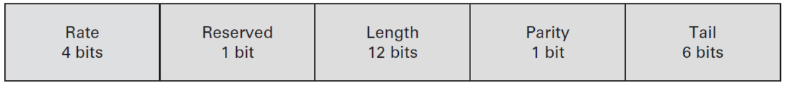
### 802.11a/g 发送过程

首先和 802.11b 一样，在传输过程中，任何一个状态也都有可能由于收到 PHY_TXEND.req 信息，而直接转移至 TxRx Switch 状态，若最终发送完成后，转移为 Rx 状态，并等待下一次传输。
1. 初始是 Rx 接收状态，在收到上层的 PHY_TXSTART.req（TXVECTOR）后，转换到 Tx Init 状态，在 802.11a/g 中，TXVECTOR 和 802.11b 基本一致。
2. 转移到 Tx Init 状态后，下一个状态是 Gen. Pream. 状态，这一步会产生 preamble，并且完成封装 preamble 中的 STF 和 LTF 两个字段的工作，即对应左图中的红色 S1-S10 部分，以及绿色 pilot1-pilot2 部分。同时 PHY 会向 MAC 层反馈 PHY_TXSTART.confirm 信息。这里的 pilot 的含义和现在的含义不一样，当前在 802.11a/g 中，pilot主要指的是用以信道估计的专用导频子载波，LTF也有这样的功能，主要一个是在传输前所使用，一个是在传输中所使用。
3. 转移到 Encode SIGNAL 状态后，这里是对 preamble 中的 singal 字段进行封装，和 802.11b 中的 PLCP Header 部分是一致的。
4. 接收到 PHY_DATA.req 之后，PHY 转移到 Encode Data 状态，对数据进行发送。当上层数据发送完毕，MAC 层发送 PHY_TXEND.req 信息，从而 PHY 层会转移至 TxRx Switch 状态对天线的工作机制进行转换。
### 802.11a/g 接收过程

1. 在 Rx 状态下，首先节点还是通过 ED 和 CS 的方式判断信道是否空闲，以及有没有对应的数据帧在信道中进行传输。如果 CS 检测到的话，那么可能就存在一个数据帧，那么需要再次通过 FD 来确定是不是一个数据帧。我们前面提到过，在 802.11a/g 中都是以相关的方式检测的，而不像 802.11b 中是采用 SFD 的方法检测帧起始部分的，所以在 FD 检测的时候，会不断的循环检测，知道找到最后一个跳变的位置（即 last peak located），那么才检测到一个帧起始。若 CS 检测失败的话，与 802.11b 相同，其会根据能量检测判断信道是否空闲，只有信道空闲时，才会转移为 ED 模式。在 Rx 状态下，当信道 busy 时，PHY 会向 MAC 通过 PHY_CCA.ind 反馈 busy，当转移回 ED 状态时，PHY 会向 MAC 反馈 idle。
2. 当 FD 识别到数据帧起始之后，转移入 PMD Est. 状态，这个状态貌似不是一个参数，且 Est. 应该是 establish 的意思。在 PMD Est. 状态之后，通过传递 PMD_DATA.ind 参数，PHY 开始处理 SINGAL 字段，其首先对其进行奇偶校验，这里没有采用 802.11b 中的 CRC 的方式，也许是为了简化一些。当解析成功后，提取解调数据所需要的 MCS 值，数据包大小等相关信息用以对上层数据包进行解析。若奇偶校验失败，则停止这一轮的传输，等待信道空闲后重新开始。
3. 当成功解析到了 SIGNAL 字段之后，PHY 层会对其数据字段的传输速率是否匹配进行判断，如果该速率是支持的话，那么转移至 DATA Decode 状态。若数据速率不支持的话，那么意味着无法解调，这里由于 STA 已经通过 SIGNAL 字段知道的数据包的大小以及传输速率，所以能够计算出数据包传输所需要花费的时间，从而就没有转移至 RSSI Monitor 状态，而是转移至 Wait Frame End 状态，等待对方释放信道，类似 NAV 的工作模式，等待计时为 0 时，转移回 ED 状态。
4. 如果 SINGAL 字段解析成功，且速率匹配的话，那么就正常接收数据包，并反馈给 MAC 层 PHY_RXSTART.ind 信息，最终当数据接收完毕之后，反馈给上层 PHY_RXEND.ind 信息，然后回到初始状态。
## OFDM 技术
802.11a/g 中，物理层采用 OFDM 技术。为了更加深入理解 OFDM 技术，我们需要明确两个概念 OFDM 符号和 OFDM 子载波。
OFDM 符号是描述 802.11a/g 的基本单元，其分为带 CP 和不带 CP 的两种形态。
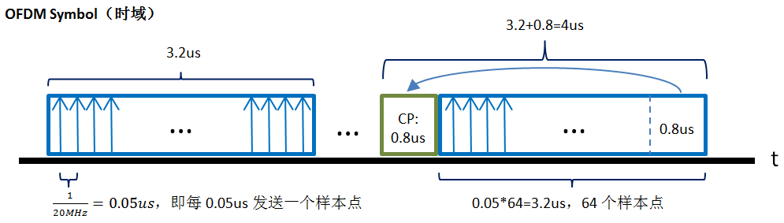
这两种形态在主要部分都会将数据分成 64 个样本点，而带 CP 的形态会在这 64 个样本点前添加一段 CP，该 CP 是原来 OFDM Symbol 的最后一段，复制到该 Symbol 的头部之前，用来避免由于时延扩展所造成的码间串扰以及载波间干扰。
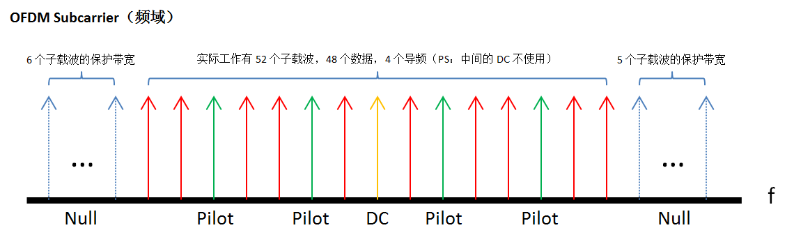
然后我们了解一下 OFDM 中子载波的结构，有四种类型：
- Null Subcarrier，图中蓝色的箭头，用来做保护间隔的，没有承载任何数据，在左边（即频率较低的一侧）有 6 个 Null 子载波，在右边有 5 个 Null 子载波；
- Pilot Subcarrier，图中绿色的箭头，用来估计信道参数并用在具体的数据解调中，承载的是特定的训练序列，一共有 4 个导频子载波；
- DC Subcarrier，图中黄色的箭头，一般材料里面没有用这个词，这里仅仅是为了描述造了一个词，在子载波中心位置的 DC subcarrier 一般都是空置不用的，所以这里标识一下；
- Data Subcarrier，图中红色的箭头，用来真实传递数据所用的子载波，在 802.11a/g 中，这种子载波一共有 52 个。
而在传输过程中，发送端将要传输的 OFDM Subcarrier 通过 IFFT 转换为一个 OFDM Symbol，接收端接收完 OFDM Symbol 的 64 个样本点之后，使用 FFT 将其再转化为 OFDM Subcarrier 的问题。
## 802.11a/g PHY 发送流程
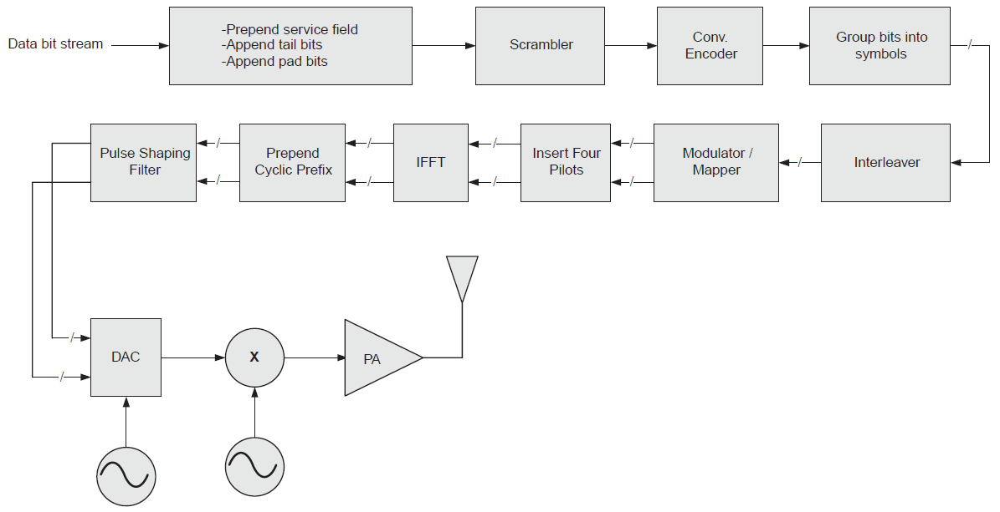
相比之前描述的 802.11a/g 的流程，我们接下来描述的内容是当物理层的数据帧中，STF，LTF 以及 SIGNAL 字段都已经封装好之后，接下来物理层发送流程的一些细节。
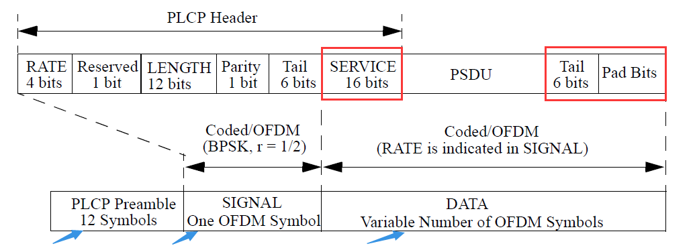
1. 首先 MAC 帧被传到下层后，会加入 service，tail，pad bits 字段；
2. 然后数据帧需要经过扰码器，在整个传输过程中，发送机和接收机需要采用相同的扰码序列；
3. 然后依次进行卷积编码（Conv. Encoder，用以增加冗余），用比特组成码元（Group bits into symbols），交织器（Interleaver，用以避免相邻的 bit 受到相同的频率选择性衰落的影响），然后对数据进行调制并映射到相应的子载波上（Modulator / Mapper）；
4. 在数据部分完成之后，接着是插入 4 个导频码（Insert Four Pilots），用来在导频子载波上使用；
5. 当准备工作完成之后，进行 IFFT 变换（IFFT），生成一个 OFDM Symbol 中的一个个样本点，在 802.11a/g 中，一共有 64 个样本点。然后将该 64 个样本点对应的后 1/4（即后面的 0.8 μs），复制到 symbol 之前，从而构造了一个带 CP 的 OFDM Symbol（Prepend Cyclic Prefix）；
6. 为了满足协议中 spectral mask 的要求，需要对每一个 OFDM Symbol 使用脉冲整形函数（Pulse Shaping Filter）进行平滑，以减少频谱旁瓣的干扰，实际上这里可以理解成是添加了一个升余弦滤波器做了一些处理；
7. 最后通过 DAC 生成模拟波形，经过混频，功率放大器 PA，最终通过天线发送出去，那么一个发送过程基本就结束了。
## 802.11a/g PHY 接收流程
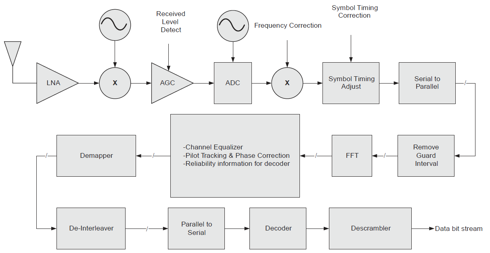
1. 首先信号经过低噪声放大器 LNA，混频之后，接收机首先通过 STF 和 LTF 字段完成初期的 AGC，频率校正（Frequency Correction），以及码元定时校正（Symbol Timing Adjust）的相关功能。同时在数据帧头部的 SIGNAL 字段中，也提供了上层解调所需要具体的 MCS 值，数据帧长度等相应信息，上图并未体现，不过这个部分信息也是需要在接收过程初期就需要获得的；
2. 对接收序列进行串并转换（Serial to Parallel），实际上可以理解成累积采样点的过程，然后移除每一个 OFDM Symbol 的保护间隔 CP（Remove Guard Interval，这里 CP 和 GI 的位置是一致的，协议表述一般为 GI），然后进行对这些采样点序列进行 FFT 变化，转换为频域子载波进行处理；
3. 利用 LTF 字段以及导频 Pilot 的相应信息对 OFDM Symbol 再一次进行一些细致的处理，包含信道均衡（Channel Equalizer），导频追踪和相位校正（Pilot Tracking & Phase Correction）以及处理一些解码所需要的可靠性的信息（Reliability information for decoder）；
4. 按序进行解映射（Demapper）和解交织（De-Interleaver）的工作，802.11a 系统是采用 BICM（Bit Interleaved Coded Modulation）的方式完成解映射，解交织的相应工作；
5. 当以上的内容处理结束后，数据就需要被进行并串转换，从而从之前的 OFDM Symbol，一个个按照一组采样点的处理方式，变成按照数据流的处理方式。然后经过解码获得解调之后的数据流；
6. 当解码之后，最后一个步骤是解扰码。接收机通过数据帧中携带的service字段作为解扰器的初始状态，从而一次解扰整个数据流。