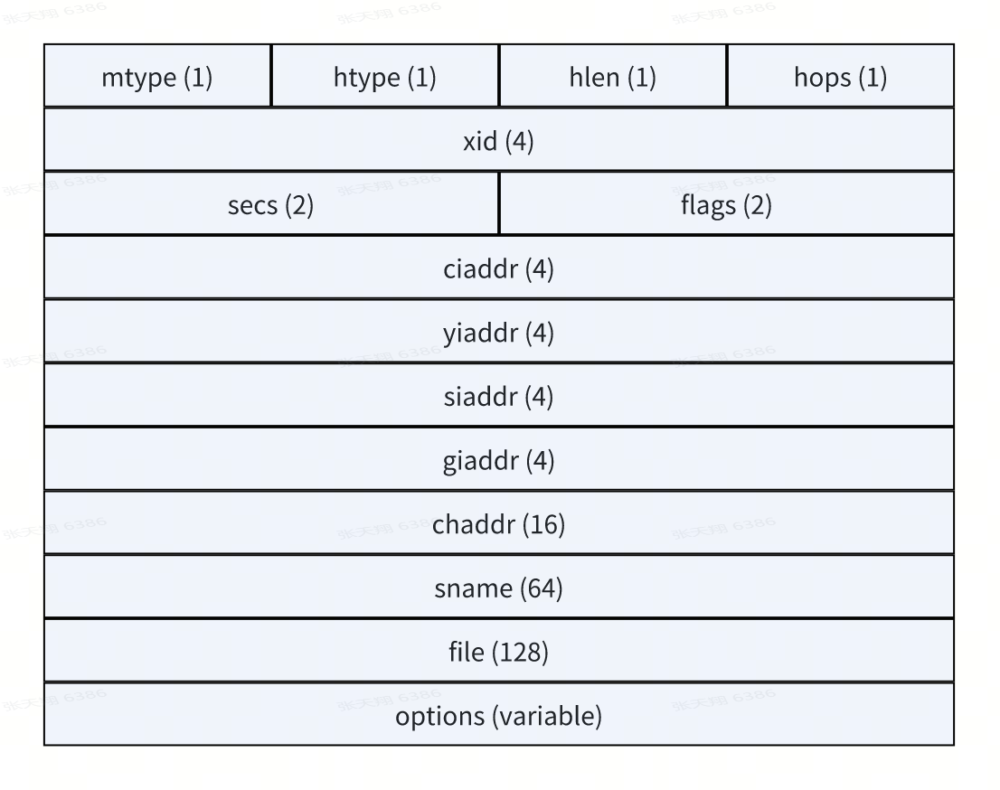
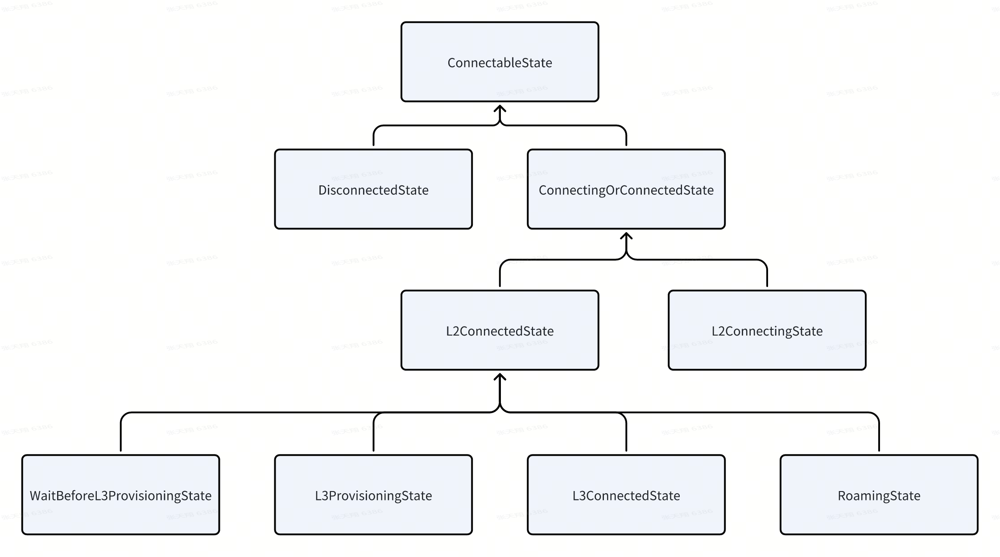

# 报文格式与各字段说明
这是 DHCP 协议的报文格式，下图各部分的长度单位为字节。

| 字段      | 英文全称                    | 说明                                                          |
| ------- | ----------------------- | ----------------------------------------------------------- |
| mtype   | Message Type            | 报文的类型，0x01 为请求报文，0x02 为响应报文                                 |
| htype   | Hardware Type           | 硬件地址类型，0x01 为以太网                                            |
| hlen    | Hardware Address Length | 硬件地址长度，以太网为 6 比特                                            |
| hops    | Hops                    | DHCP 报文当前经过的跳数                                              |
| xid     | Transaction ID          | client 端产生的随机数，用于请求和应答报文                                    |
| secs    | Seconds elapsed         | 客户端进入 IP 地址申请进程的时间或者更新 IP 地址进程的时间；由客户端软件根据情况设定。目前没有使用，固定为 0 |
| flags   | Bootp flags             | 0x0000 为单播，0x8000 为广播                                       |
| ciaddr  | Client IP Address       | 客户端 IP 地址                                                   |
| yiaddr  | Your IP Address         | 服务器分配给客户端的 IP 地址                                            |
| siaddr  | Server IP Address       | 服务器的 IP 地址                                                  |
| giaddr  | Relay agent IP Address  | 客户端发出请求报文后经过的第一个中继的 IP 地址                                   |
| chaddr  | Client Hardware Address | 客户端硬件地址                                                     |
| sname   | Server Name             | 服务器主机名                                                      |
| file    | boot file name          | 客户端启动配置文件名                                                  |
| options | Options                 | 可变长选项字段                                                     |

# Android 状态机

| 状态                            | 描述                                                                                             |
| ----------------------------- | ---------------------------------------------------------------------------------------------- |
| ConnectableState              | Wifi 打开后进入此状态，配置 Wifi MAC 地址和 IP 地址，处理 Wifi 的（重）连接事件                                           |
| ConnectingOrConnectedState    | Wifi 连接中进入此状态，主要处理驱动上报的 authenication、association、4_way_handshake、group_handshake、complete 等事件 |
| DisconnectedState             | 初始状态，客户端消息的初始事件状态机                                                                             |
| L2ConnectingState             | Wifi 连接后进入此状态，主要负责连接之后断开事件的处理，例如网络扫不到、关联被拒、认证超时等等                                              |
| L2ConnectedState              | L2 指 OSI 模型中的第二层，即数据链路层，这个状态代表数据链路层的连接已经建立完成，开始对建立连接后的网络连接状态进行轮询以及 IP 地址分配状态进行监控               |
| WaitBeforeL3ProvisioningState | 在 L2ConnectedState 和 L3ProvisioningState 之间的一个状态，避免对 IpClient 旧事件的处理                           |
| L3ProvisioningState           | IP/DNS 处理完成之后的一个状态，负责网络配置和更新                                                                   |
| L3ConnectedState              | 网络连接 IP 分配完成后进入该状态。在此状态会监控网络状态变化，例如 IP 丢失，网络评分变化                                               |
| RoamingState                  | 表示进入漫游状态。在网络异常之后先采用漫游进行恢复，如果漫游之后仍然异常，那么就直接断开，此特性需要打开配置：`config_wifiEnableLinkedNetworkRoaming` |
|                               |                                                                                                |